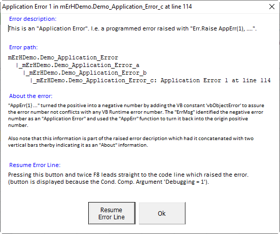
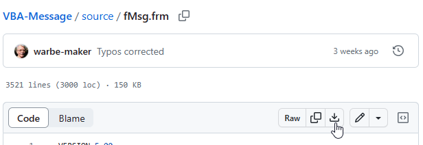
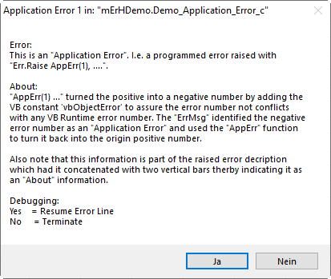
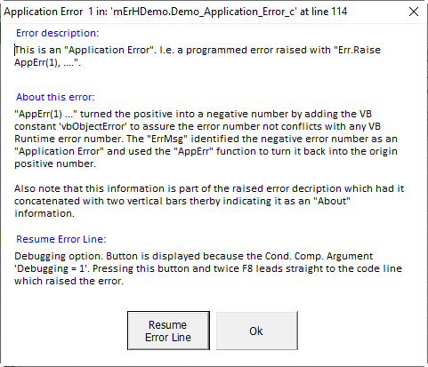
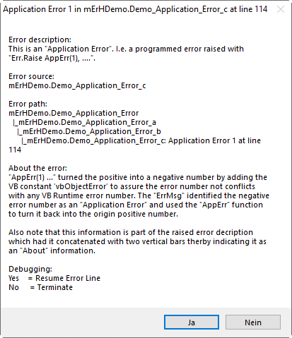

## Common VBA Error Services
> The section [Exploring the matter](#exploring-the-matter) includes a [better-than-nothing](#a-minimum-popularly-better-than-nothing-approach) approach with neither uses this _Common VBA Error Services_ nor any other additional component - with a plea &nbsp; &nbsp;**f o r** &nbsp;&nbsp; using them all. The sections aim is to somehow bootstrap the matter, last but not least towards a professional solution. The section may be skipped when one is already convinced to go all the (professional) way.

The promise of this _Common Component_: Error messages like the one below:<br>


| with                | details                                                                       |
|---------------------|-------------------------------------------------------------------------------|
|**Type of error**    | differentiating _Application Error_, _VB Runtime error_, and _Database error_)|
|**Error Number**     | either the one raised by `Err.Raise` or the one raised by the system|
|**Error Description**| of the error (_err.Description_)|
|**Error source**     | procedure which raised the error|
|**Error path**       | see [The path to the error](#the-path-to-the-error) for the required conditions|
|**About**            | Optional additional info about an error** (when concatenated to the error description with `||`)|
|***Resume Error Line*** button| obligatory |
|**Error line**       | when (pretty unlikely) available)|
  
### Services
| Service      |Kind&nbsp;[^1]| Description |
|--------------|:------------:|-------------|
|_Asserted_    | S            | Only used with regression testing (`mErH.Regression = True`) to avoid the display of errors specifically tested. When Regression = False the _Asserted_ service is ignored and any error is displayed.|
|_BoP_         | S            | Indicates the <u>**B**</u>egin <u>**o**</u>f a <u>**P**</u>rocedure and is used to maintain the call stack.<br>**Attention:** When the service is about to be used by the _Common VBA Execution Trace Service_ as well this service is exclusively to be called via an [BoC Interface](#boceoc-interface) which is to be copied in each component when used. |
|_EoP_         | S            | Indicates the <u>**E**</u>nd <u>**o**</u>f a <u>**P**</u>rocedure and is used to maintain the call stack. Triggers the display of the Execution Trace when the end of the 'Entry-Procedure' is reached.<br>**Attention:** |
|_ErrMsg_      | F            | Displays an error message either with the procedure the error had been raised (when no _BoP_ statement had ever been executed) or displays it passed on the _[Entry Procedure](#the-entry-procedure)_ (which is the first procedure with a _BoP_ statement thereby assembling  _[the-path- to-the-error](#the-path-to-the-error)_ displayed when the _[Entry Procedure](#the-entry-procedure)_ is reached.|
|_Regression_  | P w          | When TRUE the _ErrMsg_ only displays errors which are not regarded 'Asserted'.

## Installation
1. Download [_mErH.bas_][1]
2. Import _mErH_
3. Activate the error services by the _Conditional Compile Argument_ `mErH = 1` in the Project properties.

## Optional installation of the _Common VBA Message Service_
Not required but significantly improves the display of errors - thereby providing a message display service with less limits. 
1. Download [mMsg.bas][4], [fMsg.frm][2], and [fMsg.frx][3]
2. Import _mMsg_, _fMsg.frm_ to your VB-Project
3. Activate the message service by the _Conditional Compile Argument_ `mMsg = 1` in the Project properties.

## Usage
### Universal service interfaces
#### Begin/End of Procedure indication
The below procedures may be copied into any component and used in any procedure with an error message call. Alternatively, the _[Common VBA Basics Components][9]_ may be installed and the procedure called `mBasic.BoP / mBasic.EoP`. The procedures function as a universal interface which keeps the use of the _mErH_ and _mTrc_ components optional.&nbsp;[^2]
```vb
Public Sub BoP(ByVal b_proc As String, _
      Optional ByVal b_args As String = vbNullString)
' ------------------------------------------------------------------------------
' Common 'Begin of Procedure' interface serving the 'Common VBA Error Services'
' and - if not installed/activated the 'Common VBA Execution Trace Service'.
' ------------------------------------------------------------------------------
#If mErH = 1 Then          ' serves the mTrc/clsTrc when installed and active
    mErH.BoP b_proc, b_args
#ElseIf clsTrc = 1 Then ' when only clsTrc is installed and active
    Trc.BoP b_proc, b_args
#ElseIf mTrc = 1 Then   ' when only mTrc is installed and activate
    mTrc.BoP b_proc, b_args
#End If
End Sub

Public Sub EoP(ByVal e_proc As String, _
      Optional ByVal e_args As String = vbNullString)
' ------------------------------------------------------------------------------
' Common 'End of Procedure' interface serving the 'Common VBA Error Services'
' and - if not installed/activated the 'Common VBA Execution Trace Service'.
' ------------------------------------------------------------------------------
#If mErH = 1 Then          ' serves the mTrc/clsTrc when installed and active
    mErH.EoP e_proc, e_args
#ElseIf clsTrc = 1 Then ' when only clsTrc is installed and active
    Trc.EoP e_proc, e_args
#ElseIf mTrc = 1 Then   ' when only mTrc is installed and activate
    mTrc.EoP e_proc, e_args
#End If
End Sub
```
> Please not that is absolutely **essential** that BoP/EoP services are always called **paired** with identical arguments within a procedure (Sub, Function, Property)!

#### The universal _ErrMsg_ interface
The below function may be copied into any component which uses at least one error message call. Alternatively, the _[Common VBA Basics Components][9]_ may be installed and the procedure called `mBasic.ErrMsg`. It functions as a universal interface which keeps the use of the _mErH_ and _mMsg_ components optional while still providing a reasonable debugging option.&nbsp;[^2]
```vb
Private Function ErrMsg(ByVal err_source As String, _
              Optional ByVal err_no As Long = 0, _
              Optional ByVal err_dscrptn As String = vbNullString, _
              Optional ByVal err_line As Long = 0) As Variant
' ------------------------------------------------------------------------------
' Universal error message display service. Obligatory copy Private for any
' VB-Component using the common error service but not having the mBasic common
' component installed.
' Displays: - a debugging option
'           - an optional additional "About:" section when the err_dscrptn has
'             an additional string concatenated by two vertical bars (||)
'           - the error message by means of the Common VBA Message Service
'             (fMsg/mMsg) when installed and active (Cond. Comp. Arg.
'             `mMsg = 1`)
'
' Uses: AppErr  For programmed application errors (Err.Raise AppErr(n), ....)
'               to turn them into a negative and in the error message back into
'               its origin positive number.
'
' W. Rauschenberger Berlin, June 2023
' See: https://github.com/warbe-maker/VBA-Error
' ------------------------------------------------------------------------------
#If mErH = 1 Then
    '~~ When Common VBA Error Services (mErH) is availabel in the VB-Project
    '~~ (which includes the mMsg component) the mErh.ErrMsg service is invoked.
    ErrMsg = mErH.ErrMsg(err_source, err_no, err_dscrptn, err_line): GoTo xt
    GoTo xt
#ElseIf mMsg = 1 Then
    '~~ When (only) the Common Message Service (mMsg, fMsg) is available in the
    '~~ VB-Project, mMsg.ErrMsg is invoked for the display of the error message.
    ErrMsg = mMsg.ErrMsg(err_source, err_no, err_dscrptn, err_line): GoTo xt
    GoTo xt
#End If
    '~~ When neither of the Common Component is available in the VB-Project
    '~~ the error message is displayed by means of the VBA.MsgBox
    Dim ErrBttns    As Variant
    Dim ErrAtLine   As String
    Dim ErrDesc     As String
    Dim ErrLine     As Long
    Dim ErrNo       As Long
    Dim ErrSrc      As String
    Dim ErrText     As String
    Dim ErrTitle    As String
    Dim ErrType     As String
    Dim ErrAbout    As String
        
    '~~ Obtain error information from the Err object for any argument not provided
    If err_no = 0 Then err_no = Err.Number
    If err_line = 0 Then ErrLine = Erl
    If err_source = vbNullString Then err_source = Err.source
    If err_dscrptn = vbNullString Then err_dscrptn = Err.Description
    If err_dscrptn = vbNullString Then err_dscrptn = "--- No error description available ---"
    '~~ About
    ErrDesc = err_dscrptn
    If InStr(err_dscrptn, "||") <> 0 Then
        ErrDesc = Split(err_dscrptn, "||")(0)
        ErrAbout = Split(err_dscrptn, "||")(1)
    End If
    '~~ Type of error
    If err_no < 0 Then
        ErrType = "Application Error ": ErrNo = AppErr(err_no)
    Else
        ErrType = "VB Runtime Error ":  ErrNo = err_no
        If err_dscrptn Like "*DAO*" _
        Or err_dscrptn Like "*ODBC*" _
        Or err_dscrptn Like "*Oracle*" _
        Then ErrType = "Database Error "
    End If
    
    '~~ Title
    If err_source <> vbNullString Then ErrSrc = " in: """ & err_source & """"
    If err_line <> 0 Then ErrAtLine = " at line " & err_line
    ErrTitle = Replace(ErrType & ErrNo & ErrSrc & ErrAtLine, "  ", " ")
    '~~ Description
    ErrText = "Error: " & vbLf & ErrDesc
    '~~ About
    If ErrAbout <> vbNullString Then ErrText = ErrText & vbLf & vbLf & "About: " & vbLf & ErrAbout
    
    ErrBttns = vbYesNo
    ErrText = ErrText & vbLf & vbLf & "Debugging:" & vbLf & "Yes    = Resume Error Line" & vbLf & "No     = Terminate"
    ErrMsg = MsgBox(Title:=ErrTitle, Prompt:=ErrText, Buttons:=ErrBttns)
xt:
End Function
```

### The _ErrSrc_ function for distinct procedure names
```vb
Private Function ErrSrc(ByVal sProc As String) As String
    ErrSrc = "<the component's name>." & sProc
End Function
```
#### The _AppErr_ function for distinct 'Application-Error-Numbers'
```vb
Private Function AppErr(ByVal app_err_no As Long) As Long
' ------------------------------------------------------------------------------
' Ensures that a programmed 'Application' error number not conflicts with the
' number of a 'VB Runtime Error' or any other system error. Returns a given 
' positive 'Application Error' number (app_err_no) as a negative by adding the
' system constant vbObjectError. Returns the original 'Application Error' 
' number when called with a negative error number.
' ------------------------------------------------------------------------------
    If app_err_no >= 0 Then AppErr = app_err_no + vbObjectError Else AppErr = Abs(app_err_no - vbObjectError)
End Function
```

### Using the error service in any procedure
The following is the recommended coding scheme by which finding an error becomes as easy and quick as possible - provided the [Debugging option](#activating-the-debugging-option-for-the-resume-error-line-button) is activated for the 'resume the code line which causes the error' support.  
```vb
Private Sub TestProc()
    Const PROC = "TestProc"
    
    On Error GoTo eh
    BoP ErrSrc(PROC)
    '
    TestTestProc    ' this one will raise the error
    '
xt: EoP ErrSrc(PROC)
    Exit Sub

eh: Select Case ErrMsg(ErrSrc(PROC))
        Case vbResume:  Stop: Resume
        Case Else:      GoTo xt
    End Select
End Sub
```

The above may be tested with:
```vb
Private Sub TestTestProc()
    Const PROC = "TestTestProc"
    
    On Error GoTo eh
    Dim wb As Workbook
    
    BoP ErrSrc(PROC)
    Debug.Print wb.Name ' will raise a VB-Runtime error no 91

xt: EoP ErrSrc(PROC)
    Exit Sub

eh: Select Case ErrMsg(ErrSrc(PROC))
        Case vbResume:  Stop: Resume
        Case Else:      GoTo xt
    End Select
End Sub
```
When an error is displayed and the _Resume Error Line_ button is pressed the following two F8 key strokes end up at the error line. When it is again executed without any change the same error message will pop-up again of course. 

### The _Entry Procedure_
The 'registration' of the _Entry Procedure_ is crucial for the error display service. The _Entry Procedure_ is the one which calls other procedures but itself is not called by a procedure - but by an event or via Application.Run instead for example. When these procedures have a _BoP/EoP_ service call the the _[path-to-the-error](#the-path-to-the-error)_ may be complete provided the [Debugging option](#activating-the-debugging-option-for-the-resume-error-line-button) is not activated.  

### The path to the error
Irrespective of the approach which assembles a "path-to-the-error": The knowledge of the involved procedure's name (see the [better-than-nothing example](#a-minimum-popularly-better-than-nothing-approach) is a key issue.

| Approach | Description | Pro | Con |
|----------|-------------|-----|-----|
| ***Bottom up***| The path is assembled when the error is passed on up to the _[Entry Procedure](#the-entry-procedure)_. | This approach assembles the path provided the _Entry Procedure_ is known, i.e. has `BoP/EoP` statements. The completeness of the path does not depend on other passed `BoP/EoP` code lines on the way down to the error raising procedure. | This approach is contradicted by the debugging ( _Resume the Error Line_ ) option which is provided with each error message.| 
| ***Top down***| A call stack is maintained with each `BoP/EoP` service call. | The _path-to-the-error_ is as complete as the passed `BoP/EoP` service calls on the the way down to the error raising procedure. This approach provides a complete path to the error regardless the fact that the error message is directly displayed within the error raising procedure (or by the last procedure passed which had an `On Error Goto ..` statement.| The completeness/extent of the path- to-the-error depends on the passed `BoP/EoP` statements.|

> ***Conclusion***: Procedures with an error handling (those with `On Error Goto eh`) should also have `BoP/EoP` statements - quasi as a default). Providing potential_[Entry Procedure](#the-entry-procedure)_ with `BoP/EoP` statements should be obligatory.

### _Regression_ test
#### Activation
With `mErH.Regression = True` at the beginning of a series of test procedures the display of _'[asserted](#asserted-errors-service)'_ errors will be suspended thereby supporting an uninterrupted regression test.
#### _Asserted_ error(s) service
Used with regression testing. Errors which a are regarded asserted because explicitly tested are not displayed in order not to interrupt the test procedure. Effective only when the [_Regression_](#regression-test-activation) property is set to True.
Example: When the tested error is a programmed _Application Error_ (raised by: `Err.Raise AppErr(1), ErrSrc(PROC), "error description"`) the error is asserted by `mErH.Asserted AppErr(1)`.

### Using the optional _fMsg/mMsg_ components for a better designed error message
When the two components are installed and activated they are automatically used by the _[ErrMsg](#the-errmsg-function-as-universal-interface)_ function to display the error message not only significantly better designed but also more clear for how to use the _Debugging option_. If desired follow the below steps.
1. Download _[fMsg.frm][2]_, _[fMsg.frx][3]_, _[mMsg.bas][4]_
2. Import into your VB-Project ***fMsg.frm*** and ***mMsg.bas***
3. Activate them by the Cond. Comp. Arg. `mMsg = 1`

### Download from public GitHub repo
It may appear pretty strange when downloading first from a public GitHub repo but is is quite straight forward as the below image shows.  


## Exploring the matter
### Used _Common Components_
The best possible result (last example) requires the additional _[Common VBA Message Service](#using-the-optional-fmsgmmsg-components-for-a-better-designed-error-message)_. The difference between using and not using it shown below.
<small>

| ErrMsg&nbsp;[^3]| mErH | mMsg | Example result                         | Error<br>path |Resume<br>caption| Lay-<br>out|
|:------:|:----:|:----:|----------------------------------------|:-------------:|:----------------:|:----:|
| yes    |  no  |  no  |    | no            | no               |  no  |      
| yes    |  no  |  yes |   | no            | yes              |  yes |
| yes    |  yes |  no  |   | yes           | no               |  no  |
| yes    |  yes |  yes |  | yes           | yes              |  yes |

</small>

### A minimum, popularly "better-than-nothing", approach

The below code provides the maximum regarding debugging with a minimum of effort and means - with the following properties, together with a plea for possible improvements [^4]
<small>

| Property                     | Provided | Comment (the possible improvement) |
|------------------------------|:--------:|------------------------------------|
| Error number and description | Yes      | `Err.Number` and `Err.Description` provides the info. |
| Error source                 | Yes       | A ` Const PROC = "...."` statement is used to identify the procedures name and the `ErrSrc` function is used to prefix it with the component's name.|
| Application error number     | No       | A "kind-of-error" distinction is provided by the more elaborated "universal"  _[ErrMsg](#the-errmsg-function-as-universal-interface)_ function which uses the _[AppErr](#the-apperr-function-for-distinct-application-error-numbers)_ for this. |
| (proceed to) Error line      | Yes      | By using the _fMsg/mMsg_ components buttons may be named precisely for what they mean |
| Info "about" error           | No       | Requires a more elaborated error message like the  _[ErrMsg](#the-errmsg-function-as-universal-interface)_ function |
| Path to the error            | No       | The display of a "path-to-the-error" is provided by the _Common VBA Error Services_ component _[mErH][1]_ which maintains a call stack and a back-up collection of the passed procedures.|
| Pre-asserted errors          | No       | The _Common VBA Error Services_ component _[mErH][1]_ provides a 'Regression-Test' option which suppresses the display of 'asserted', i.e. explicitly tested, errors. |
| Execution Trace              | No       | Only when the _Common VBA Execution Trace service_ (_[clsTrc][8]_ or _[mTrc][7]_ component) is installed and activated the _Common VBA Error Services_ component _[mErH][1]_ passes on BoP/EoP statements 'by the way' supporting an execution trace.|
| Debugging option              | Yes    | The much more elaborated [_Common VBA Message Service_](#using-the-optional-fmsgmmsg-components-for-a-better-designed-error-message) provides an optimum display of the involved buttons.|

</small>

```vb
Private Sub Demo()
    Demo_a 10, 0
    MsgBox "Execution continued since the error has been ignored!"
End Sub

Private Sub Demo_a(ByVal d_a As Long, _
                   ByVal d_b As Long)
    Const PROC = "Demo_a"
    
    On Error GoTo eh
    Debug.Assert d_a / d_b

xt: Exit Sub

eh: Select Case ErrMsg(ErrSrc(PROC))
        Case vbRetry:   Stop: Resume
        Case vbAbort:   GoTo xt
    End Select
End Sub

Private Function ErrMsg(ByVal err_src As String) As Variant
' ----------------------------------------------------------------------------
' Universal error message, providing a debugging option.
' Note: Since the possible Buttons arguments are limitied the used argument
'       is a "best of" choice.
' ----------------------------------------------------------------------------
    ErrMsg = MsgBox(Title:="An error occoured in " & err_src & "!" _
                    , Prompt:="Error " & Err.Number & ": " & Err.Description & vbLf & vbLf & _
                              "Retry  = Proceed to the error line option" & vbLf & _
                              "Cancel = Proceed to the end of the error causing procedure." _
                    , Buttons:=vbRetryCancel)
End Function

Private Function ErrSrc(ByVal sProc As String) As String
    ErrSrc = "mDemo." & sProc
End Function
```

## Other
### Conflict management
This _Common Component_ has become a standard in all my VB-Projects. However, it is **optional** with all my _Common Components_ in order to keep them autonomous and not depending on other components. See [Conflicts with personal and public _Common Components_][5] for more details.

### Contribution, development, test, maintenance
Any contribution of any kind will be welcome. The dedicated _Common VBA Component Workbook_ **[ErH.xlsm][6]** is used for development, maintenance, and last but not least for the testing.

[^1]: S=Sub, F=Function, P=Property (r=read/Get, w=write/Let)
[^2]: All (my) Common Components make use of these `Private` procedures in order to keep the autonomous. I.e. they are independent from any other component but will use them when installed and activated.  
[^3]: The [_ErrMsg_ function](#the-universal-interface-errmsg-function) is the universal interface which allows to keep the _[mErH][1]_ component and the [_Common VBA Message Service_](#using-the-optional-fmsgmmsg-components-for-a-better-designed-error-message) optional while still providing a debugging option when neither is installed/activated. These procedures may also be copied from the _[mBasic.bas][9]_ component as `Private` function (as used within all _Common Components_) or used directly when downloaded and imported.
[^4]: All my (public) _Common Components_ provide a built-in README service which displays the component's corresponding README in the public GitHub repo.

[1]:https://github.com/warbe-maker/VBA-Error/blob/master/source/mErH.bas
[2]:https://github.com/warbe-maker/VBA-Message/blob/master/source/fMsg.frm
[3]:https://github.com/warbe-maker/VBA-Message/blob/master/source/fMsg.frx
[4]:https://github.com/warbe-maker/VBA-Message/blob/master/source/mMsg.bas
[5]:https://warbe-maker.github.io/vba/common/2022/02/15/Personal-and-public-Common-Components.html
[6]:https://github.com/warbe-maker/VBA-Error/blob/master/source/ErH.xlsm
[7]:https://github.com/warbe-maker/VBA-Trace/blob/master/source/mTrc.bas
[8]:https://github.com/warbe-maker/VBA-Trace/blob/master/source/clsTrc.bas
[9]:https://github.com/warbe-maker/VBA-Message
