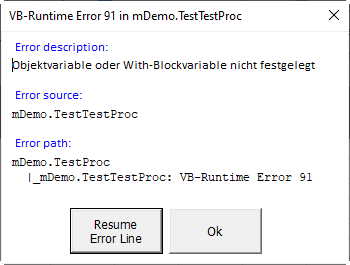

## Common VBA Error Services
All services are invoked through procedures copied into each module (see [Preparing the module](#preparing-the-module) and [Preparing procedures](#preparing-procedures). As a result an error message will look as follows:<br>


Provided are:
  - **Type of the error** (distinction of Application Error, VB Runtime error, and Database error)
  - **Error Number**
  - **Error Description** of the error (_err.Description_)
  - **Error source** (procedure which raised the error)
  - **Error path** (see [The path to the error](#the-path-to-the-error) for the required conditions) 
  - **Additional information about an error** (optional when concatenated to the error description with ||)
  - **A _Resume Error Line_ button** (optional when the _Conditional Compile Argument_ `Debugging = 1`)
  - **Error line** (when available)
  
  > This error services are used with all my _[Common VBA Components][7]_ in all my VB-Projects which are all prepared to function completely autonomously (download, import, use) but at the same time to integrate with my personal 'standard' VB-Project design. See [Conflicts with personal and public _Common Components_][5] for more details.

### Services
| Service      |Kind&nbsp;[^1]| Description |
|--------------|:------------:|-------------|
|_Asserted_    | S            | Only used with regression testing (Regression = True) to avoid the display of errors specifically tested. When Regression = False the _Asserted_ service is ignored and any error is displayed.|
|_BoP_         | S            | Indicates the <u>**B**</u>egin <u>**o**</u>f a <u>**P**</u>rocedure and is used to maintain the call stack.<br>**Attention:** When the service is about to be used by the _Common VBA Execution Trace Service_ as well this service is exclusively to be called via an [BoC Interface](#boceoc-interface) which is to be copied in each component when used. |
|_EoP_         | S            | Indicates the <u>**E**</u>nd <u>**o**</u>f a <u>**P**</u>rocedure and is used to maintain the call stack. Triggers the display of the Execution Trace when the end of the 'Entry-Procedure' is reached.<br>**Attention:** |
|_ErrMsg_      | F            | Displays an error message either with the procedure the error had been raised (when no _BoP_ statement had ever been executed) or displays it passed on the _[Entry Procedure](#the-entry-procedure)_ (which is the first procedure with a _BoP_ statement thereby assembling  _[the-path- to-the-error](#the-path-to-the-error)_ displayed when the _[Entry Procedure](#the-entry-procedure)_ is reached.|
|_Regression_  | P w          | When TRUE the _ErrMsg_ only displays errors which are not regarded 'Asserted'.


[^1]: S=Sub, F=Function, P=Property (r=read/Get, w=write/Let)

## Installation
1. Download [_mErH.bas_][1]
2. Import _mErH_
3. Activate the error services by the _Conditional Compile Argument_ `ErHComp = 1`
4. Activate the [Debugging option](#activating-the-debugging-option-for-the-resume-error-line-button) by the  _Conditional Compile Argument_ `Debugging = 1`

## Optional installation of the _Common VBA Message Service_
Not required but significantly improves the display of errors - thereby providing a message display service with less limits. 
1. Download [mMsg.bas][4], [fMsg.frm][2], and [fMsg.frx][3]
2. Import _mMsg_, _fMsg.frm_ to your VB-Project
3. Activate the message service by the _Conditional Compile Argument_ `MsgComp = 1`

## Usage
### Service interfaces
> It is **essential** that BoP/EoP services are always called **paired** with identical arguments!

Copy the two procedures into any component using the error services.
```vb
Private Sub BoP(ByVal b_proc As String, ParamArray b_arguments() As Variant)
' ------------------------------------------------------------------------------
' Common 'Begin of Procedure' interface serving the 'Common VBA Error Services'
' and the 'Common VBA Execution Trace Service'. To be copied into any component
' using the BoP service - either through the 'Common VBA Error Services' and/or
' the 'Common VBA Execution Trace Service'.
' ------------------------------------------------------------------------------
    Dim s As String: If Not IsMissing(b_arguments) Then s = Join(b_arguments, ";")
#If ErHComp = 1 Then
    '~~ The error handling will also hand over to the Common VBA Execution Trace
    '~~ provided one is installed (mTrc/clsTrc) and activated.
    mErH.BoP b_proc, s
#ElseIf XcTrc_clsTrc = 1 Then
    '~~ mErH is not installed but the mTrc is
    Trc.BoP b_proc, s
#ElseIf XcTrc_mTrc = 1 Then
    '~~ mErH neither mTrc is installed but clsTrc is
    mTrc.BoP b_proc, s
#End If
End Sub

Private Sub EoP(ByVal e_proc As String, Optional ByVal e_inf As String = vbNullString)
' ------------------------------------------------------------------------------
' Common 'End of Procedure' interface serving the 'Common VBA Error Services'
' and the 'Common VBA Execution Trace Service'. To be copied into any component
' using the EoP service - either through the 'Common VBA Error Services' and/or
' the 'Common VBA Execution Trace Service'.
' ------------------------------------------------------------------------------
#If ErHComp = 1 Then
    '~~ The error handling will also hand over to the Common VBA Execution Trace
    '~~ provided one is installed (mTrc/clsTrc) and activated.
    mErH.EoP e_proc
#ElseIf XcTrc_clsTrc = 1 Then
    Trc.EoP e_proc, e_inf
#ElseIf XcTrc_mTrc = 1 Then
    mTrc.EoP e_proc, e_inf
#End If
End Sub
```
### Other procedures
Copy the following into any component which uses the error services. The ErrMsg procedure provides a comprehensive error message when the [Debugging option](#activating-the-debugging-option-for-the-resume-error-line-button) is activated even without having the _mErH_ nor the _fMsg/mMsg_ components are installed/activated.
```vb
Private Function AppErr(ByVal app_err_no As Long) As Long
' ------------------------------------------------------------------------------
' Ensures that a programmed 'Application' error number not conflicts with the
' number of a 'VB Runtime Error' or any other system error. Returns a given 
' positive 'Application Error' number (app_err_no) as a negative by adding the
' system constant vbObjectError. Returns the original 'Application Error' 
' number when called with a negative error number.
' ------------------------------------------------------------------------------
    If app_err_no >= 0 Then AppErr = app_err_no + vbObjectError Else AppErr = Abs(app_err_no - vbObjectError)
End Function

Private Function ErrMsg(ByVal err_source As String, _
               Optional ByVal err_no As Long = 0, _
               Optional ByVal err_dscrptn As String = vbNullString, _
               Optional ByVal err_line As Long = 0) As Variant
' ------------------------------------------------------------------------------
' Universal error message display service which displays:
' - a debugging option button (Conditional Compile Argument 'Debugging = 1')
' - an optional additional "About:" section when the err_dscrptn has an
'   additional string concatenated by two vertical bars (||)
' - the error message by means of the Common VBA Message Service (fMsg/mMsg)
'   Common Component
'   mMsg (Conditional Compile Argument "MsgComp = 1") is installed.
'
' Uses:
' - AppErr  For programmed application errors (Err.Raise AppErr(n), ....)
'           to turn them into a negative and in the error message back into
'           its origin positive number.
' - ErrSrc  To provide an unambiguous procedure name by prefixing is with
'           the module name.
'
' W. Rauschenberger Berlin, Apr 2023
'
' See: https://github.com/warbe-maker/VBA-Error
' ------------------------------------------------------------------------------
#If ErHComp = 1 Then
    '~~ When Common VBA Error Services (mErH) is availabel in the VB-Project
    '~~ (which includes the mMsg component) the mErh.ErrMsg service is invoked.
    ErrMsg = mErH.ErrMsg(err_source, err_no, err_dscrptn, err_line): GoTo xt
    GoTo xt
#ElseIf MsgComp = 1 Then
    '~~ When (only) the Common Message Service (mMsg, fMsg) is available in the
    '~~ VB-Project, mMsg.ErrMsg is invoked for the display of the error message.
    ErrMsg = mMsg.ErrMsg(err_source, err_no, err_dscrptn, err_line): GoTo xt
    GoTo xt
#End If
    '~~ When neither of the Common Component is available in the VB-Project
    '~~ the error message is displayed by means of the VBA.MsgBox
    Dim ErrBttns    As Variant
    Dim ErrAtLine   As String
    Dim ErrDesc     As String
    Dim ErrLine     As Long
    Dim ErrNo       As Long
    Dim ErrSrc      As String
    Dim ErrText     As String
    Dim ErrTitle    As String
    Dim ErrType     As String
    Dim ErrAbout    As String
        
    '~~ Obtain error information from the Err object for any argument not provided
    If err_no = 0 Then err_no = Err.Number
    If err_line = 0 Then ErrLine = Erl
    If err_source = vbNullString Then err_source = Err.source
    If err_dscrptn = vbNullString Then err_dscrptn = Err.Description
    If err_dscrptn = vbNullString Then err_dscrptn = "--- No error description available ---"
    
    '~~ Consider extra information is provided with the error description
    If InStr(err_dscrptn, "||") <> 0 Then
        ErrDesc = Split(err_dscrptn, "||")(0)
        ErrAbout = Split(err_dscrptn, "||")(1)
    Else
        ErrDesc = err_dscrptn
    End If
    
    '~~ Determine the type of error
    Select Case err_no
        Case Is < 0
            ErrNo = AppErr(err_no)
            ErrType = "Application Error "
        Case Else
            ErrNo = err_no
            If err_dscrptn Like "*DAO*" _
            Or err_dscrptn Like "*ODBC*" _
            Or err_dscrptn Like "*Oracle*" _
            Then ErrType = "Database Error " _
            Else ErrType = "VB Runtime Error "
    End Select
    
    If err_source <> vbNullString Then ErrSrc = " in: """ & err_source & """"   ' assemble ErrSrc from available information"
    If err_line <> 0 Then ErrAtLine = " at line " & err_line                    ' assemble ErrAtLine from available information
    ErrTitle = Replace(ErrType & ErrNo & ErrSrc & ErrAtLine, "  ", " ")         ' assemble ErrTitle from available information
       
    ErrText = "Error: " & vbLf & ErrDesc & vbLf & vbLf & "Source: " & vbLf & err_source & ErrAtLine
    If ErrAbout <> vbNullString Then ErrText = ErrText & vbLf & vbLf & "About: " & vbLf & ErrAbout
    
#If Debugging = 1 Then
    ErrBttns = vbYesNo
    ErrText = ErrText & vbLf & vbLf & "Debugging:" & vbLf & "Yes    = Resume Error Line" & vbLf & "No     = Terminate"
#Else
    ErrBttns = vbCritical
#End If
    ErrMsg = MsgBox(Title:=ErrTitle, Prompt:=ErrText, Buttons:=ErrBttns)
xt: End Function

End Function

Private Function ErrSrc(ByVal sProc As String) As String
    ErrSrc = "<the component's name>." & sProc
End Function
```

### Using the error service in any procedure
The following is the recommended coding scheme by which finding an error becomes as easy and quick as possible - provided the [Debugging option](#activating-the-debugging-option-for-the-resume-error-line-button) is activated for the 'resume the code line which causes the error' support.  
```vb
Private Sub TestProc()
    Const PROC = "TestProc"
    
    On Error GoTo eh
    BoP ErrSrc(PROC)
    '
    TestTestProc    ' this one will raise the error
    '
xt: EoP ErrSrc(PROC)
    Exit Sub

eh: Select Case ErrMsg(ErrSrc(PROC))
        Case vbResume:  Stop: Resume
        Case Else:      GoTo xt
    End Select
End Sub
```

The above may be tested with:
```vb
Private Sub TestTestProc()
    Const PROC = "TestTestProc"
    
    On Error GoTo eh
    Dim wb As Workbook
    
    BoP ErrSrc(PROC)
    Debug.Print wb.Name ' will raise a VB-Runtime error no 91

xt: EoP ErrSrc(PROC)
    Exit Sub

eh: Select Case ErrMsg(ErrSrc(PROC))
        Case vbResume:  Stop: Resume
        Case Else:      GoTo xt
    End Select
End Sub
```
When an error is displayed and the _Resume Error Line_ button is pressed the following two F8 key strokes end up at the error line. When it is again executed without any change the same error message will pop-up again of course. 

### Activating the Debugging option for the _Resume Error Line_ button
Set the _Conditional Compile Argument_ `Debuggig = 1` (may of course be set to 0 when the VB-Project becomes productive)

### The _Entry Procedure_
The 'registration' of the _Entry Procedure_ is crucial for the error display service. The _Entry Procedure_ is the one which calls other procedures but itself is not called by a procedure - but by an event or via Application.Run instead for example. When these procedures have a _BoP/EoP_ service call the the _[path-to-the-error](#the-path-to-the-error)_ may be complete provided the [Debugging option](#activating-the-debugging-option-for-the-resume-error-line-button) is not activated.  

### The path to the error
This _Common VBA Error Services_ support the display of a _path-to-the-error_ by two approaches which are combined for a best possible result.

| Approach | Description | Pro | Con |
|----------|-------------|-----|-----|
| ***Bottom up***| The path is assembled when the error is passed on up to the _[Entry Procedure](#the-entry-procedure)_. | This approach assembles a complete path which includes also procedures not having `BoP/EoP` statements provided the _Entry Procedure_ is known (has `BoP/EoP` statements).| The path will not be available when the error message is called immediately with the error raising procedure. This is the case either when the _Entry Procedure_ is unknown, i.e. no procedure with `BoP/EoP` statements had been invoked, or when the [Debugging option](#activating-the-debugging-option-for-the-resume-error-line-button) displays an extra button to _Resume the Error Line_ which means that even when the _Entry Procedure_ is known the message has to be displayed immediately to provide the choice.| 
| ***Top down***| An call stack is maintained with each `BoP/EoP` service call. | The _path-to-the-error_ is as complete as supported by the `BoP/EoP` service calls all the way down to the error raising procedure even when the 'Debugging' option forced the error being displayed immediately within the procedure the error occurreded (which is the way to allow resuming the error line).| The completeness/extent of the path- to-the-error depends on the `BoP/EoP` statements.|

> ***Conclusion***: Procedures with an error handling (those with On error Goto eh) should also have `BoP/EoP` statements - quasi as a default). Providing potential_[Entry Procedure](#the-entry-procedure)_ with `BoP/EoP` statements should be obligatory.

### Regression test issues
I use the following two services for the Regression tests set up with all my _[Common VBA Components][7].

#### _Asserted_ error(s) service
Used with regression testing. Errors which a are regarded asserted because explicitly tested are not displayed in order not to interrupt the test procedure. Effective only when the [_Regression_](#regression-test-activation) property is set to True.
Example: When the tested error is a programmed _Application Error_ (raised by: `Err.Raise AppErr(1), ErrSrc(PROC), "error description"`) the error is asserted by `mErH.Asserted AppErr(1)`.

### _Regression_ test activation
When at the beginning of a series of test procedures `mErH.Regression` is set to `True` the display of _[Asserted](#asserted-errors-service)_ errors will be suspended thereby supporting an uninterrupted regression test.

### Download from public GitHub repo
It may appear pretty strange when downloading first from a public GitHub repo but is is quite straight forward as the below image shows.  


## Contribution, development, test, maintenance
Any contribution of any kind will be welcome. The dedicated _Common VBA Component Workbook_ **[ErH.xlsm][6]** is used for development, maintenance, and last but not least for the testing.


[1]:https://github.com/warbe-maker/VBA-Error/blob/master/source/mErH.bas
[2]:https://github.com/warbe-maker/VBA-Error/blob/master/source/fMsg.frm
[3]:https://github.com/warbe-maker/VBA-Error/blob/master/source/fMsg.frx
[4]:https://github.com/warbe-maker/VBA-Error/blob/master/source/mMsg.bas
[5]:https://warbe-maker.github.io/vba/common/2022/02/15/Personal-and-public-Common-Components.html
[6]:https://github.com/warbe-maker/VBA-Error/blob/master/source/ErH.xlsm
[7]:https://warbe-maker.github.io/vba/common/2021/02/19/Common-VBA-Components.html
